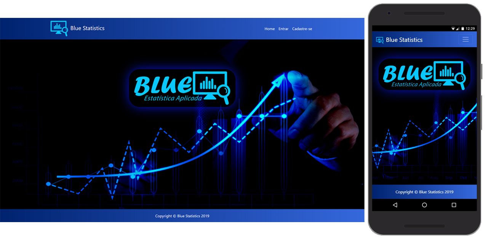

# Blue Statistics	

[Blue Statistics](https://github.com/WillDFz/Blue-Statistics "Blue Statistics") é um software voltado para a realização de cálculos relacionados à estatística aplicada,
que engloba estatística descritiva, probabilidade, correlação e regressão. 

[

## Projeto de Estatistica 

Este é um repositório para a prototipação do Blue Statistics: Software de Estatística desenvolvido para avaliação no 3 ciclo do curso de Análise e Desenvolvimento de Sistemas - Fatec Franca - 2019.

## MVP

O MVP é uma versão inicial muito limitada do Blue Statistcs. O objetivo é criar o mínimo necessário para realizar operações básicas de estatística. 

## Pré Requisitos
Para execução do sistema, é necessária conexão com a internet e instalação de um dos seguintes navegadores:
Google Chrome (versão 58 ou superior), Mozilla Firefox (versão 54 ou superior) ou Microsoft Edge (versão 14 ou superior). 
O sistema não precisa ser instalado para ser executado.

## Como utilizar o sistema
Na tela inicial, o usuário pode optar entre entrar no sistema (login ou como convidado) e cadastrar-se.
Após entrar no sistema, o usuário pode escolher entre as três opções de operações do sistema:
estatística descritiva, probabilidade ou correlação e regressão. (estatística descritiva e correlação e regressão aceitam
importação de dados no formato csv).
Na estatística descritiva, o único campo que deve ser preenchido obrigatoriamente é o campo de dados 
(valores numéricos ou não) , os outros campos retornarão resultados adicionais/relativos à escolha do usuário. 
A estatística descritiva retornará uma tabela principal, uma tabela secundária e os gráficos resultantes. 
Na probabilidade, o usuário pode escolher probabilidade uniforme, binomial ou normal, e cada uma das operações pede dados
diferentes. Os resultados retornados sempre serão em porcentagem.
A correlação e regressão pede obrigatoriamente a inserção de dois vetores de valores numéricos. Os resultados retornados
serão: Gráfico, coeficiente de variação e coeficiente da reta. Após a exibição dos dados, o usuário pode optar por fazer
uma projeção utilizando o coeficiente da reta.
## Tecnologias utilizadas

HTML5/CSS3

JavaScript (ECMAScript 6)

Bootstrap 4

Highcharts

ChartJs

## Ferramentas utilizadas

Microsoft Visual Studio Code

Bizagi

Astah

Storyboard That

Microsoft Oficce

Magic Vector 

Adobe Photoshop CC

Git/GitHub

StackOverflow

Visual Paradigm Online

Discord

## Autores
[Bianca Junia de Castro Gomes](https://github.com/biancajcastrog "Bianca Junia de Castro Gomes")

[Danilo Matias Martins](https://github.com/DaniloMatias "Danilo Matias Martins")

Vinicius Henrique César

[William Dourado Ferreira](https://github.com/WillDFz "William Dourado Ferreira")

## Colaboradores
[Vinícius Rocha](https://github.com/vorocha "Vinícius Rocha")

## Considerações finais
A criação deste sistema foi uma ótima oportunidade para aprender novos conceitos de programação, conceitos de cálculos
estatísticos e a buscar qualquer tipo de informação que agregaria novas características relevantes no sistema, como 
ferramentas e fóruns. Agradecemos o auxilio do aluno Vinícius Rocha, que apesar de não estar cursando a disciplina de 
estatística no momento, teve papel importante na implementação de características do software e feedback. Agradecemos também 
todos os professores envolvidos no projeto, pelo suporte durante toda a realização do projeto. 

